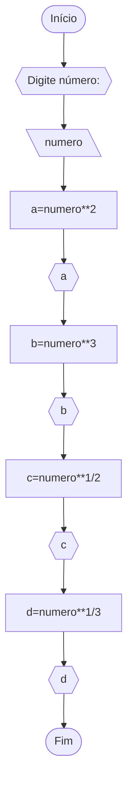

Lista2_20quetões
Lista2_20quetões

# Unifor 
**Nome**: Luiza
**Nome de disciplina**: Raciocínio lógico algorítmico

## Lista2_questão1
### Fluxograma


### Pseudocódigo 
```
	ALGORITMO media_inteiros
	DECLARE A,B,C,D,M: Numéricos
	INICIO
	ESCREVA "Digite quatro números:"
	LEIA A,B,C,D
	M<--A+B+C+D
	M<--M/4
	FIM
```

### Teste
|numero|soma |media|
|--|--|--|
|2,4,6,8|20|5|
|1,1,1,1|4|1|
|10,20,30,40|100|25|
|5,5,5,5|20|5|

## Lista2_questão2
### Fluxograma


### Pseudocódigo
```
	ALGORÍTMO temperatura
	DECLARE C,F: NUMÉRICO
	ESCREVA “Digite a temperatura”
	LEIA C
	F=(9/5)C+32
	ESCREVA F
	FIM_ALGORITMO
```

## Lista2_questão3
### Fluxograma


### Pseudocódigo
```
	ALGORITMO pol_to_mili
	DECLARE qpol, qmili: NUMERICO float >= 0
	INICIO
	ESCREVA "Digite a quantidade de chuva em polegadas:"
	LEIA qpol
	qmili<--qpol*25.4mm
	ESCREVA "Quantidade de chuva em milímetros:" qmili
	FIM_ALGORITMO
```

## Lista2_questão4
### Fluxograma


### Pseudocódigo
```
	ALGORITMO custo_carro
	DECLARE custo_fabrica, custo_consumidor: NUMERICO float >= 0
	INICIO
	ESCREVA "Digite custo de fábrica:"
	LEIA custo_fabrica
	custo_consumidor <-- custo_fabrica + (0,45 * custo_fabrica) + (0,12 * custo_fabrica)
	LEIA custo_consumidor
	ESCREVA "Custo do consumidor:" custo_consumidor
	FIM
```

## Lista2_questão5
### Fluxograma


### Pseudocódigo
```
	ALGORITMO numero_ao_quadrado
	DECLARE numero, numero_quadrado: NUMERICO float >=0
	INICIO
	ESCREVA "Digite um número:"
	LEIA numero
	numero_quadrado <-- numero * numero
	ESCREVA "numero ao quadrado é:" numero_quadrado
	FIM
```

## Lista2_questão6
### Fluxograma


### Pseudocódigo
```
	ALGORITMO contafinal
	DECLARE qhburg, qchees, qfritas, qrefri, qmilk: NUMERICO
    DECLARE total NUMERICO float >=0
	INICIO
	ESCREVA "Digite no painel a quantidade de itens consumidos:"
	LEIA qhburg, qchees, qfritas, qrefri
	total <-- (qhburg * 3) + (qchees * 2,50) + (qfritas * 2,50) + (qrefri * 1) + (qmilk * 3)
	ESCREVA "Total a pagar: R$" total
	FIM
```

## Lista2_questão7
### Fluxograma


### Pseudocódigo
```
	ALGORITMO salario-vendendor
	DECLARE salario, comissao, quant_carro, valor_venda: NUMERICO 
	float >= 0 
	INICIO
	ESCREVA "Digite número de carros vendidos:"
	LEIA quant_carro
	ESCREVA "Digite valor das vendas:"
	LEIA valor_venda
	comissao<--(50 * quant_carro) + [(valor_venda * 0.05)]
	salario<--500 + comissao
	ESCREVA "Seu salário:" salario
	Fim
```

## Lista2_questão8
### Fluxograma


### Pseudocódigo
```
	ALGORITMO media-rla
	DECLARE notaprova, notaqualita, media: NUMERICO float >= 0
	DECLARE nome_aluno String
	INICIO
	ESCREVA "Insira seu nome completo:"
	LEIA nome_aluno
	ESCREVA "Digite a nota da prova:"
	LEIA notaprova
	ESCREVA "Digite a nota qualitativa:"
	LEIA notaqualita
	media → [(notaprova * 2) + (notaqualita * 1)] / 3
	ESCREVA media
		FIM
```

## Lista2_questão9
### Fluxograma


### Pseudocódigo
```
	ALGORITMO ficha_escricao
	DECLARE nome, curso, email: String
	DECLARE matricula, idade NUMERICO int 
	INICIO
	ESCREVA "Digite nome, curso, email, matricula, idade: "
	LEIA nome, curso, email, matricula, idade
	ESCREVA "FICHA DE INSCRIÇÃO"
	ESCREVA "NOME:" nome
	ESCREVA "MATRICULA:" matricula
	ESCREVA "CURSO:" curso
	ESCREVA "EMAIL:" email
	ESCREVA "IDADE" idade
	FIM
```

## Lista2_questão10
### Fluxograma


### Pseudocódigo
```
	ALGORITMO apcirculo
	DECLARE area, raio, perimetro: NUMERICO float =>0
	DECLARE area metro**2
	DECLARE raio, perimetro metro
	INICIO
	ESCREVA "Digite raio do círculo:"
	LEIA raio
	area  Ⲡ * raio**2
	ESCREVA "A área do círculo é:" area
	perimetro <--  2 * Ⲡ * raio
	ESCREVA "O perímetro do círculo é:" perimetro
	FIM
```

## Lista2_questão11
### Fluxograma


### Pseudocódigo
```
	ALGORITMO program
	DECLARE numero, a, b, c, d: NUMERICO float >=0
	INICIO
	ESCREVA "Digite número:"
	LEIA numero
	SE numero > 0
		a <-- numero**2
		ESCREVA a
		b <-- numero**3
		ESCREVA b
		c <-- numero**1/2
		ESCREVA c
		d <-- numero**1/3
		ESCREVA d
	SENAO
		ESCREVA "O numero é menor que zero"
	FIM_SE
	FIM
```

## Lista2_questão12
### Fluxograma


### Pseudocódigo 
```
	ALGORITMO ordem
	DECLARE O, a, b, c: NUMÉRICO 
	INICIO
	ESCREVA "Digite três numeros: "
	LEIA a, b, c
		ESCOLHA
			CASO (a<b e a<c e b<c)
				O<—a, b, c
			CASO (a<b e a<c e c<b)
				O<—a, c, b
			CASO (b<a e b<c e a<c)
				O<—b, a, c
			CASO (b<a e b<c e c<a)
				O<—b, c, a
			CASO (c<a e c<b e a<b)
				O<—c, a, b
			SENÃO
				O<—c, b, a
		FIM_ESCOLHA
	ESCREVA O
	FIM
```

## Lista2_questão13
### Fluxograma


### Pseudocódigo 
```
ALGORITMO categoria 
	DECLARE i: NUMERICO
	INICIO
	ESCREVA "Digite a idade: "
	LEIA i
		SE (i>=5)
			ESCOLHA 
				CASO (5<=i e i<=7)
					ESCREVA "Infantil A"
				CASO (8<=i e i<=10)
					ESCREVA "Infantil B"
				CASO (11<=i e i<=13)
					ESCREVA "Juvenil A"
				CASO (14<=i e i<=17)
					ESCREVA "Juvenil B"
				SENÃO
					ESCREVA "Adulto"
			FIM_ESCOLHA
		SENÃO
		FIM_SE
FIM
```

## Lista2_questão14
### Fluxograma


### Pseudocodigo
```
ALGORITMO menor
DECLARE a,b,c: NUMERICO
INICIO
ESCREVA "Digite três números"
	ESCOLHA 
		CASO (a<b e a<c)
			ESCREVA a
		CASO (b<a e b<c)
			ESCREVA b
		CASO (c<a e c<b)
			ESCREVA c
	FIM_ESCOLHA
FIM
```

## Lista2_questão15
### Fluxograma


### Pseudocodigo
```
ALGORITMO peso
DECLARE x: NUMERICO
INICIO
	ESCREVA "Digite o numero"
	LEIA x
		SE (x>=0)
			x <-- x * 2.2
		SENÃO
			ESCREVA "numero nao aceito"
		FIM_SE
	ESCREVA x
FIM
```

## Lista2_questão16
### Fluxograma


### Pseudocodigo
```
ALGORITMO status
DECLARE x: NUMERICO
INICIO
	ESCREVA "Digite um numero"
	LEIA x
		ESCOLHA
			CASO (x>=6)
				ESCREVE "AP"
			CASO (x<3)
				ESCREVA "RM"
			SENÃO
				ESCREVA "PF"
		FIM_ESCOLHA
FIM
```

## Lista2_questão17
### Fluxograma


### Pseudocodigo
```
ALGORITMO salário
DECLARE s: NUMERICO
INICIO
	ESCREVA "Digite o salario bruto"
	LEIA s
		ESCOLHA 
			CASO (s<=1499.15)
				s=s
			CASO (1499.16<=s e s<=2246.75)
				s=s*0.925
			CASO (2246.76<=s e s<=2995.70)
				s=s*0.85
			CASO (2995.71<=s e s<=3743.19)
				s=s*0.775
			SENÃO
				s=s*0.725
		FIM_ESCOLHA
	ESCREAVA "salario liquido: "s
FIM
```
## Lista2_questão18
### Fluxograma

### Pseudocodigo
```
ALGORITMO conversao
DECLARE x: NUMERICO float<=10
INICIO
	ESCREVA "digite a nota"
	LEIA x
	ESCOLHA
		CASO (x<=10 e x>=9)
			ESCREVA "A"
		CASO (x<=8.9 e x>=8)
			ESCREVA "B"
		CASO (x<=7.9 e x>=7)
			ESCREVA "C"
		CASO (x<=6.9 e x>=5)
			ESCREVA "E"
		SENÃO
			ESCREVA "F"
	FIM_ESCOLHA
FIM
```
## Lista2_questão19
### Fluxograma

### Pseudocodigo
```
ALGORITMO definição
DECLARE x: NUMERICO
INICIO
	ESCREVA "digite o numero"
	LEIA x
	ESCOLHA
		CASO (x>0)
			ESCREVA "positivo"
		CASO (x<0)
			ESCREVA "negativo"
		SENÃO
			ESCREVA "nulo"
	FIM_ESCOLHA
FIM 
```
## Lista2_questão20
### Fluxograma

### Pseudocodigo
```
ALGORITMO operação
DECLARE a, b, c: NUMÉRICO 
DECLARE o STRING 
INICIO 
ESCREVA "Digite dois números:" 
LEIA a, b 
ESCREVA "Digite a operação (+, -, *, /):" 
LEIA o 
	ESCOLHA 
		CASO (o==+)
			c <-- a + b 
		CASO (0==-)
			c <-- a - b 
		CASO (o==*)
			c <-- a * b 
		CASO (o==/)
			SE (b != 0) ENTÃO 
				c <-- a / b 
			SENÃO 
				ESCREVA "divisão por zero" 
			FIM_SE 
		SENÃO 
			ESCREVA "Operação inválida" 
	FIM ESCOLHA 
	ESCREVA c 
FIM
```

Unifor
Nome: Luiza
Nome de disciplina: Raciocínio lógico algorítmico

Lista2_questão1
Fluxograma
Início
Escreva quatro número
A,B,C,D
M=A+B+C+D
M=M/4
Fim
Pseudocódigo
	ALGORITMO media_inteiros
	DECLARE A,B,C,D,M: Numéricos
	INICIO
	ESCREVA "Digite quatro números:"
	LEIA A,B,C,D
	M<--A+B+C+D
	M<--M/4
	FIM
Teste
numero	soma	media
2,4,6,8	20	5
1,1,1,1	4	1
10,20,30,40	100	25
5,5,5,5	20	5
Lista2_questão2
Fluxograma
Início
Digite a temperatura
C
F=(9/5)C+32
F
Fim
Pseudocódigo
	ALGORÍTMO temperatura
	DECLARE C,F: NUMÉRICO
	ESCREVA “Digite a temperatura”
	LEIA C
	F=(9/5)C+32
	ESCREVA F
	FIM_ALGORITMO
Lista2_questão3
Fluxograma
Início
Digite a quantidade de chuva em polegadas:
qpo1
qmili=qpol*25.4mm
Quantidade de chuva em milímetros: qmili
Fim
Pseudocódigo
	ALGORITMO pol_to_mili
	DECLARE qpol, qmili: NUMERICO float >= 0
	INICIO
	ESCREVA "Digite a quantidade de chuva em polegadas:"
	LEIA qpol
	qmili<--qpol*25.4mm
	ESCREVA "Quantidade de chuva em milímetros:" qmili
	FIM_ALGORITMO
Lista2_questão4
Fluxograma
Início
Digite custo de fábrica:
custo_fabrica
custo_consumidor=custo_fabrica+(0,45*custo_fabrica)+(0,12*custo_fabrica)
Custo do consumidor: custo_consumidor
Fim
Pseudocódigo
	ALGORITMO custo_carro
	DECLARE custo_fabrica, custo_consumidor: NUMERICO float >= 0
	INICIO
	ESCREVA "Digite custo de fábrica:"
	LEIA custo_fabrica
	custo_consumidor <-- custo_fabrica + (0,45 * custo_fabrica) + (0,12 * custo_fabrica)
	LEIA custo_consumidor
	ESCREVA "Custo do consumidor:" custo_consumidor
	FIM
Lista2_questão5
Fluxograma
Início
Digite um número:
numero
numero_quadrado=numero**2
numero ao quadrado é: numero_quadrado
Fim
Pseudocódigo
	ALGORITMO numero_ao_quadrado
	DECLARE numero, numero_quadrado: NUMERICO float >=0
	INICIO
	ESCREVA "Digite um número:"
	LEIA numero
	numero_quadrado <-- numero * numero
	ESCREVA "numero ao quadrado é:" numero_quadrado
	FIM
Lista2_questão6
Fluxograma
Início
Digite no painel a quantidade de itens consumidos:
qhburg, qchees, qfritas, qrefri
total=(qhburg*3)+(qchees*2.50)+(qfritas*2.50)+(qrefri*1)+(qmilk*3)
Total a pagar: R$ total
fim
Pseudocódigo
	ALGORITMO contafinal
	DECLARE qhburg, qchees, qfritas, qrefri, qmilk: NUMERICO
    DECLARE total NUMERICO float >=0
	INICIO
	ESCREVA "Digite no painel a quantidade de itens consumidos:"
	LEIA qhburg, qchees, qfritas, qrefri
	total <-- (qhburg * 3) + (qchees * 2,50) + (qfritas * 2,50) + (qrefri * 1) + (qmilk * 3)
	ESCREVA "Total a pagar: R$" total
	FIM
Lista2_questão7
Fluxograma
Início
Digite número de carros vendidos:
quant_carro
Digite valor das vendas:
valor_venda
comissao=(50*quant_carro)+(valor_venda*0.05)
salario=500+comissao
salario
Fim
Pseudocódigo
	ALGORITMO salario-vendendor
	DECLARE salario, comissao, quant_carro, valor_venda: NUMERICO 
	float >= 0 
	INICIO
	ESCREVA "Digite número de carros vendidos:"
	LEIA quant_carro
	ESCREVA "Digite valor das vendas:"
	LEIA valor_venda
	comissao<--(50 * quant_carro) + [(valor_venda * 0.05)]
	salario<--500 + comissao
	ESCREVA "Seu salário:" salario
	Fim
Lista2_questão8
Fluxograma
Início
Insira seu nome completo:
nome_aluno
Digite a nota da prova:
notaprova
Digite a nota qualitativa:
notaqualita
media=((notaprova*2)+notaqualita)/3
media
Fim
Pseudocódigo
	ALGORITMO media-rla
	DECLARE notaprova, notaqualita, media: NUMERICO float >= 0
	DECLARE nome_aluno String
	INICIO
	ESCREVA "Insira seu nome completo:"
	LEIA nome_aluno
	ESCREVA "Digite a nota da prova:"
	LEIA notaprova
	ESCREVA "Digite a nota qualitativa:"
	LEIA notaqualita
	media → [(notaprova * 2) + (notaqualita * 1)] / 3
	ESCREVA media
		FIM
Lista2_questão9
Fluxograma
Início
Digite nome, curso, email, matricula, idade:
nome, curso, email, matricula, idade
FICHA DE INSCRIÇÃO
NOME: nome
MATRICULA: matricula
CURSO: curso
EMAIL: email
IDADE: idade
Fim
Pseudocódigo
	ALGORITMO ficha_escricao
	DECLARE nome, curso, email: String
	DECLARE matricula, idade NUMERICO int 
	INICIO
	ESCREVA "Digite nome, curso, email, matricula, idade: "
	LEIA nome, curso, email, matricula, idade
	ESCREVA "FICHA DE INSCRIÇÃO"
	ESCREVA "NOME:" nome
	ESCREVA "MATRICULA:" matricula
	ESCREVA "CURSO:" curso
	ESCREVA "EMAIL:" email
	ESCREVA "IDADE" idade
	FIM
Lista2_questão10
Fluxograma
Início
Digite raio do círculo:
raio
area=Ⲡ*raio**2
A área do círculo é: area
perimetro=2*Ⲡ*raio
O perímetro do círculo é: perimetro
Fim
Pseudocódigo
	ALGORITMO apcirculo
	DECLARE area, raio, perimetro: NUMERICO float =>0
	DECLARE area metro**2
	DECLARE raio, perimetro metro
	INICIO
	ESCREVA "Digite raio do círculo:"
	LEIA raio
	area  Ⲡ * raio**2
	ESCREVA "A área do círculo é:" area
	perimetro <--  2 * Ⲡ * raio
	ESCREVA "O perímetro do círculo é:" perimetro
	FIM
Lista2_questão11
Fluxograma
Início
Digite número:
numero
a=numero**2
a
b=numero**3
b
c=numero**1/2
c
d=numero**1/3
d
Fim
Pseudocódigo
	ALGORITMO program
	DECLARE numero, a, b, c, d: NUMERICO float >=0
	INICIO
	ESCREVA "Digite número:"
	LEIA numero
	SE numero > 0
		a <-- numero**2
		ESCREVA a
		b <-- numero**3
		ESCREVA b
		c <-- numero**1/2
		ESCREVA c
		d <-- numero**1/3
		ESCREVA d
	SENAO
		ESCREVA "O numero é menor que zero"
	FIM_SE
	FIM
Lista2_questão12
Fluxograma
Nã
Nã
Nã
Nã
Nã
Sim
Sim
Sim
Sim
Sim
Início
Digite três numeros:
a,b,c
a<b e a<c e b<c
a<b e a<c e c<b
b<a e b<c e a<c
b<a e b<c e c<a
c<a e c<b e a<b
O=c,b,a
O=a,b,c
O=a,c,b
O=b,a,c
O=b,c,a
O=c,a,b
O
Fim
Pseudocódigo
	ALGORITMO ordem
	DECLARE O, a, b, c: NUMÉRICO 
	INICIO
	ESCREVA "Digite três numeros: "
	LEIA a, b, c
		ESCOLHA
			CASO (a<b e a<c e b<c)
				O<—a, b, c
			CASO (a<b e a<c e c<b)
				O<—a, c, b
			CASO (b<a e b<c e a<c)
				O<—b, a, c
			CASO (b<a e b<c e c<a)
				O<—b, c, a
			CASO (c<a e c<b e a<b)
				O<—c, a, b
			SENÃO
				O<—c, b, a
		FIM_ESCOLHA
	ESCREVA O
	FIM
Lista2_questão13
Fluxograma
sim
nã
nã
nã
nã
sim
sim
sim
nã
Início
Digite a idade:
i
i>=5
5<=i e i<=7
8<=i e i<=10
11<=i e i<=13
14<=i e i<=17
Adulto
Juvenil B
Juvenil A
Fim
Infantil B
Infantil A
Pseudocódigo
ALGORITMO categoria 
	DECLARE i: NUMERICO
	INICIO
	ESCREVA "Digite a idade: "
	LEIA i
		SE (i>=5)
			ESCOLHA 
				CASO (5<=i e i<=7)
					ESCREVA "Infantil A"
				CASO (8<=i e i<=10)
					ESCREVA "Infantil B"
				CASO (11<=i e i<=13)
					ESCREVA "Juvenil A"
				CASO (14<=i e i<=17)
					ESCREVA "Juvenil B"
				SENÃO
					ESCREVA "Adulto"
			FIM_ESCOLHA
		SENÃO
		FIM_SE
FIM
Lista2_questão14
Fluxograma
nã
nã
sim
sim
Início
Digite três números
a<b e a<c
b<a e b<c
c<a e c<b
c
Fim
a
b
Pseudocodigo
ALGORITMO menor
DECLARE a,b,c: NUMERICO
INICIO
ESCREVA "Digite três números"
	ESCOLHA 
		CASO (a<b e a<c)
			ESCREVA a
		CASO (b<a e b<c)
			ESCREVA b
		CASO (c<a e c<b)
			ESCREVA c
	FIM_ESCOLHA
FIM
Lista2_questão15
Fluxograma
nã
sim
Início
Digite o numero
x
x>=0
numero nao aceito
Fim
x = x * 2.2
x
Pseudocodigo
ALGORITMO peso
DECLARE x: NUMERICO
INICIO
	ESCREVA "Digite o numero"
	LEIA x
		SE (x>=0)
			x <-- x * 2.2
		SENÃO
			ESCREVA "numero nao aceito"
		FIM_SE
	ESCREVA x
FIM
Lista2_questão16
Fluxograma
sim
nã
sim
nã
Início
Digite um numero
x
x>=6
AP
x<3
RM
PF
Fim
Pseudocodigo
ALGORITMO status
DECLARE x: NUMERICO
INICIO
	ESCREVA "Digite um numero"
	LEIA x
		ESCOLHA
			CASO (x>=6)
				ESCREVE "AP"
			CASO (x<3)
				ESCREVA "RM"
			SENÃO
				ESCREVA "PF"
		FIM_ESCOLHA
FIM
Lista2_questão17
Fluxograma
sim
nã
sim
nã
sim
nã
sim
nã
Início
Digite o salario bruto
s
s<=1499.15
s=s
1499.16<=s e s<=2246.75
s=s*0.925
2246.76<=s e s<=2995.70
s=s*0.85
2995.71<=s e s<=3743.19
s=s*0.775
s=s*0.725
s
Pseudocodigo
ALGORITMO salário
DECLARE s: NUMERICO
INICIO
	ESCREVA "Digite o salario bruto"
	LEIA s
		ESCOLHA 
			CASO (s<=1499.15)
				s=s
			CASO (1499.16<=s e s<=2246.75)
				s=s*0.925
			CASO (2246.76<=s e s<=2995.70)
				s=s*0.85
			CASO (2995.71<=s e s<=3743.19)
				s=s*0.775
			SENÃO
				s=s*0.725
		FIM_ESCOLHA
	ESCREAVA "salario liquido: "s
FIM
Lista2_questão18
Fluxograma
SIM
NÃO
SIM
NÃO
SIM
NÃO
SIM
NÃO
Início
digite a nota
x
x<=10 e x>=9
A
x<=8.9 e x>=8
B
x<=7.9 e x>=7
C
x<=6.9 e x>=5
E
F
Fim
Pseudocodigo
ALGORITMO conversao
DECLARE x: NUMERICO float<=10
INICIO
	ESCREVA "digite a nota"
	LEIA x
	ESCOLHA
		CASO (x<=10 e x>=9)
			ESCREVA "A"
		CASO (x<=8.9 e x>=8)
			ESCREVA "B"
		CASO (x<=7.9 e x>=7)
			ESCREVA "C"
		CASO (x<=6.9 e x>=5)
			ESCREVA "E"
		SENÃO
			ESCREVA "F"
	FIM_ESCOLHA
FIM
Lista2_questão19
Fluxograma
nã
nã
sim
sim
Início
digite o numero
x
x>0
x<0
nulo
positivo
negativo
Fim
Pseudocodigo
ALGORITMO definição
DECLARE x: NUMERICO
INICIO
	ESCREVA "digite o numero"
	LEIA x
	ESCOLHA
		CASO (x>0)
			ESCREVA "positivo"
		CASO (x<0)
			ESCREVA "negativo"
		SENÃO
			ESCREVA "nulo"
	FIM_ESCOLHA
FIM 
Lista2_questão20
Fluxograma
nã
nã
nã
nã
sim
sim
sim
sim
Início
Digite dois números:
a,b
Digite a operação (+, -, *, /):
o
o==+
0==-
o==*
o==/
b!=0
divisão por zero
c <-- a / b
c <-- a + b
c <-- a - b
c <-- a * b
c
Fim
Pseudocodigo
ALGORITMO operação
DECLARE a, b, c: NUMÉRICO 
DECLARE o STRING 
INICIO 
ESCREVA "Digite dois números:" 
LEIA a, b 
ESCREVA "Digite a operação (+, -, *, /):" 
LEIA o 
	ESCOLHA 
		CASO (o==+)
			c <-- a + b 
		CASO (0==-)
			c <-- a - b 
		CASO (o==*)
			c <-- a * b 
		CASO (o==/)
			SE (b != 0) ENTÃO 
				c <-- a / b 
			SENÃO 
				ESCREVA "divisão por zero" 
			FIM_SE 
		SENÃO 
			ESCREVA "Operação inválida" 
	FIM ESCOLHA 
	ESCREVA c 
FIM
Markdown 12259 bytes 1471 words 684 lines Ln 14, Col 12HTML 57645 characters 2167 words 374 paragraphs
Syntax error in graph
mermaid version 8.9.2
