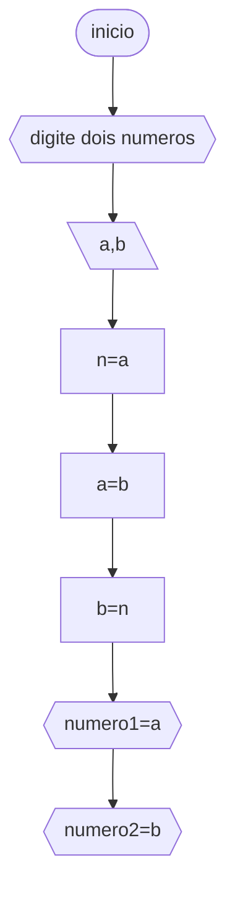
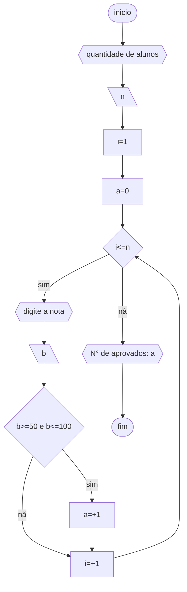
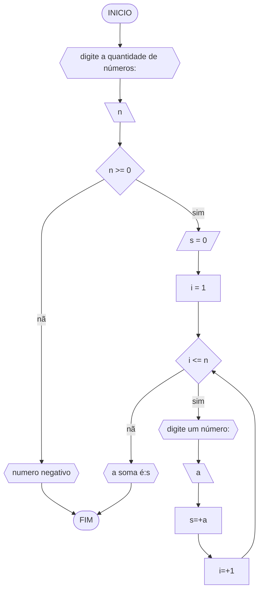
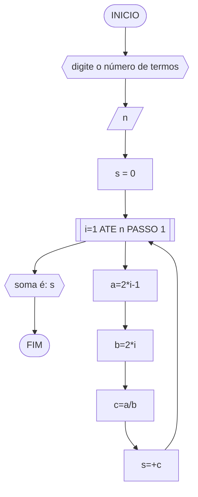
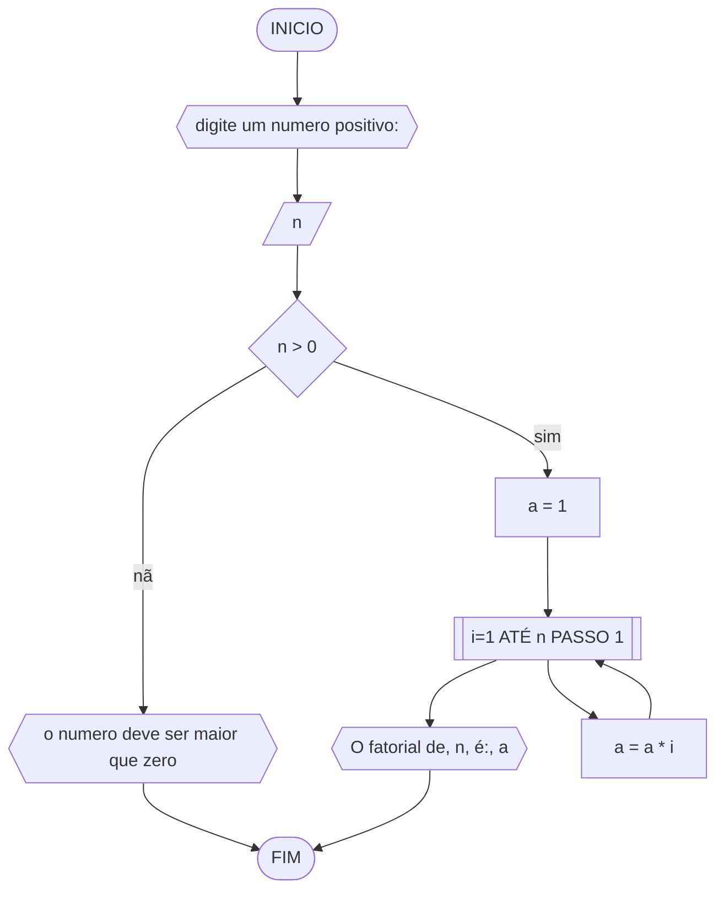
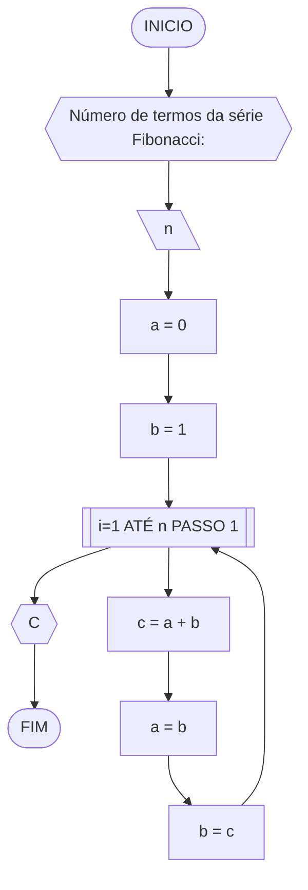
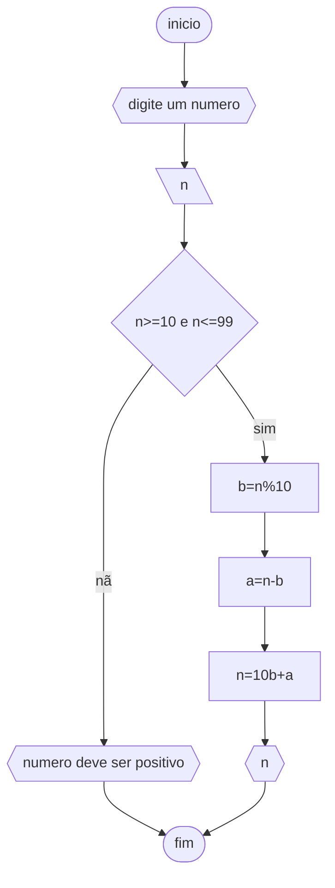

# Unifor 
**Nome**: Luiza
**Nome de disciplina**: Raciocínio lógico algorítmico

## Q1
### fluxograma

### Pseudocodigo
```
ALGORITMO troca_valor
DECLARE a,b,n: NUMERICO
ESCREVA "digite dois numeros"
LEIA a,b
n<--a
a<--b
b<--n
ESCREVA "numero1="a
ESCREVA "numero2="b
```
### Teste
| a  | b  | n | a  | b  | saída 1 | saída 2 | 
| -- | -- | --  | -- | -- | --      | --      | 
| 0  | 1  | 0   | 1  | 0  | numero1 = 1   | numero2 = 0   |

### Q2
### Fuxograma

### Pseudocodigo
```
ALGORITMO aprovados
DECLARE n,a,b,i: NUMERICO
INICIO
ESCREVA "quantidade de alunos"
LEIA n
i<--1
a<--0
	ENQUANTO (i<=n)
		ESCREVA "digite a nota"
		LEIA b
			SE (b>=50 e b<=100)
				a<--+1
			FIM_SE
		i<--+1
	FIM_ENQUANTO
ESCREVA "N° de aprovados: "a
FIM
```
### Teste
 n  | i  | a | i<=n  | nota | nota_valida | a+1 | i+1 | saída        | 
 -|-|-|-|-|-|-|-|-|-
 3  | 1  |  0   | sim   | 60   | sim | 1 | 2   | - |
 3  | 2  |  1   | sim   | 40   | não | 1 | 3   | - |
 3  | 3  |  1   | sim   | 90   | sim | 2 | 4   | - |
 3  | 4  |  2   | não  | - | - | - | - | N° de aprovados: 2 |


## Q3
### Fluxograma

### Pseudocodigo
```
ALGORITMO soma
DECLARE n,s,a,i: NUMERICO
INICIO
ESCREVA "digite a quantidade de números:"
LEIA n
	SE (n>=0)
		s<--0
		i<--1
		ENQUANTO (i <= n)
			ESCREVA "digite um número:"
			LEIA a
			s<--+a
			i<--+1
		FIM_ENQUANTO
		ESCREVA "a soma é: "s
	SENÃO
		ESCREVA "numero negativo"
	FIM_SE
FIM
```
### Teste
| it | n  | n >= 0 | soma | i  | i <= n | num | soma =+ num  | saída                   |
| -- | -- | --     | --   | -- | --     | --  | --           | --                      |
|    | -3 | False  |      |    |        |     |              | O valor deve ser ...    |
| 1  | 0  | True   | 0    | 1  | False  |     |              | A soma dos números é 0  |
| 1  | 3  | True   | 0    | 1  | True   | 5   | 0 + 5 = 5    |                         |
| 2  | 3  | True   | 5    | 2  | True   | 10  | 5 + 10 = 15  |                         |
| 3  | 3  | True   | 15   | 3  | True   | 20  | 15 + 20 = 35 |                         |
| 4  | 3  | True   | 35   | 4  | False  |     |              | A soma dos números é 35 |

## Q4
### Fluxograma

### Pseudocodigo
```
ALGARITMO soma
DECLARE a,b,c,s,n,i: NUMERICO
INICIO
ESCREVA "digite o numero de termos"
LEIA n
s<--0
i<--1
	PARA (i=1 ate n passo 1)
		a=i*2-1
		b=i*2
		c=a/b
		s=+c
	FIM_PARA
ESCREVA "soma é: "s
FIM
```
### Teste 

 n  | i | a | b | c | s=+c | saída |
 - | - |- | - | -| - | - | - |
4 | 1 | 2*1-1 = 1 | 2*1 = 2  | 1/2  | 0+1/2 = 1/2    | -                       |
4 | 2 | 2*2-1 = 3 | 2*2 = 4  | 3/4  | 1/2+3/4 = 1.25 |  -                     |
4 | 3 | 2*3-1 = 5 | 2*3 = 6  | 5/6  | 0+1/2 = 2.08   |  -                     |
4 | 4 | 2*4-1 = 7 | 2*4 = 8  | 7/8  | 0+1/2 = 2.96   | Soma da série S é 2.96 |

## Q5
### Fluxograma

### Pseudocodigo
```
ALGARITMO fatorial
DECLARE a,n,i: NUMERICO
INICIO
ESCREVA "digite um numero positivo"
LEIA n
	SE (n>0)
		a<--1
		PARA (i=1 ate n passo 1)
			a=a*i
		FIM_PARA
	SENÃO
		ESCREVA "o numero deve ser maior que zero"
	FIM_SE
FIM
```
### Teste 
| n  | a | i  | a = a * i | saída |
| -- | -- | -- | -- | -- |
| 3  | 1 | 1 | 1*1 = 1 | - |
| 3  | 1 | 2 | 1*2 = 2 | - |
| 3  | 2 | 3 | 2*3 = 6 | O fatorial de 3 é 6 |

## Q6
### Fluxograma 

### Pseudocodigo
```
ALGARITMO fibonacci
DECLARE a,b,c,n,i: NUMERICO
INICIO
ESCREVA "Número de termos da série Fibonacci:"
LEIA n
a<--0
b<--1
	PARA (i=1 ATÉ n PASSO 1)
		c<--a+b
		a=b
		b=c
	FIM_PARA
ESCREVA {{C}}
FIM	
```
### Teste
| it | n  | a  | b  | i  | saída | c = a + b | a = b | b = c|
| -- | -- | -- | -- | -- | --    | --                  | --    | --              |
| 1  | 5  | 0  | 1  | 1  | 0     | 0 + 1 = 1           | 1     | 1               |
| 2  | 5  | 1  | 1  | 2  | 1     | 1 + 1 = 2           | 1     | 2               |
| 3  | 5  | 1  | 2  | 3  | 1     | 1 + 2 = 3           | 2     | 3               |
| 4  | 5  | 2  | 3  | 4  | 2     | 2 + 3 = 5           | 3     | 5               |
| 4  | 5  | 3  | 5  | 5  | 3     | 3 + 5 = 8           | 5     | 8               |

## Q7
### fluxograma

### Pseudocodigo
```
ALGARITMO troca_ordem
DECLARE a,b,n: NUMERICO
INICIO
ESCREVA "digite um numero"
LEIA n
	SE (n>=10 e n<=99)
		b<--n%10
		a<--n-b
		n<--10b+a
		ESCREVA n
	SENÃO
	ESCREVA "numero deve ser positivo"
	FIM_SE
FIM
```
### Teste
n | n>=10 e n<=99 | b | a | saida
-|-|-|-|-
11| sim | 1| 1| 11
21| sim |1 | 2|12
