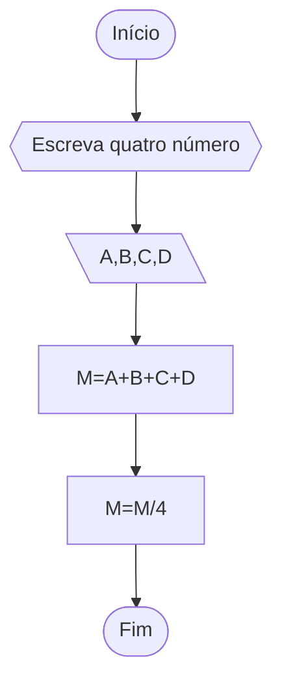
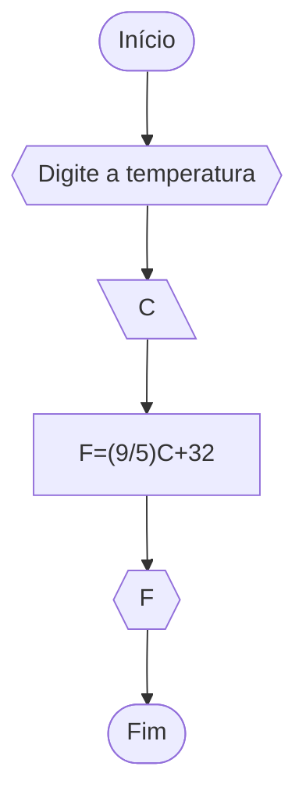
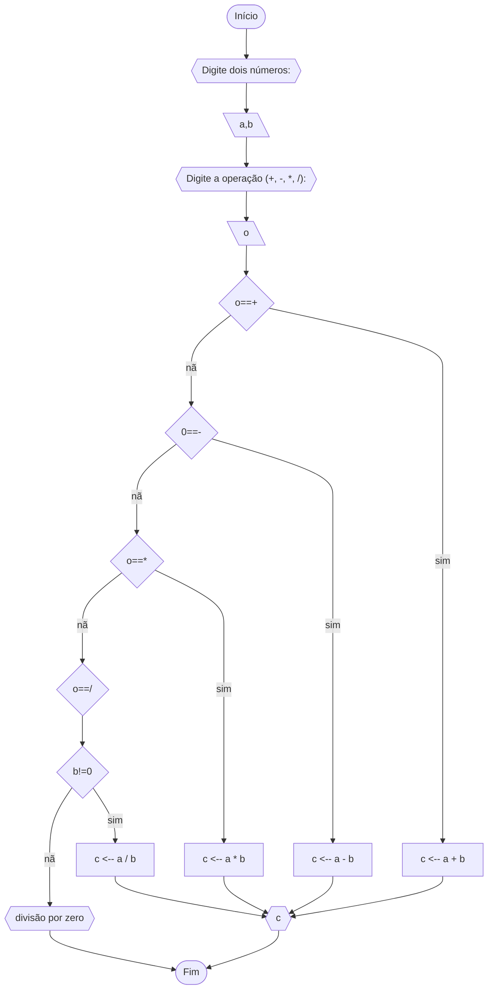
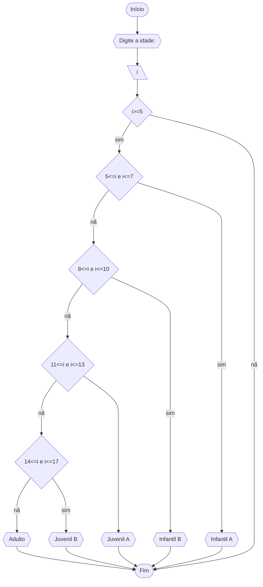

# Unifor 
**Nome**: Luiza
**Nome de disciplina**: Raciocínio lógico algorítmico

## Q1
### Fluxograma


### Pseudocódigo 
```
	ALGORITMO media_inteiros
	DECLARE A,B,C,D,M: Numéricos
	INICIO
	ESCREVA "Digite quatro números:"
	LEIA A,B,C,D
	M<--A+B+C+D
	M<--M/4
	FIM
```

### Teste
|numero|soma |media|
|--|--|--|
|2,4,6,8|20|5|
|1,1,1,1|4|1|
|10,20,30,40|100|25|
|5,5,5,5|20|5|

## Q2
### Fluxograma


### Pseudocódigo
```
	ALGORÍTMO temperatura
	DECLARE C,F: NUMÉRICO
	ESCREVA “Digite a temperatura”
	LEIA C
	F=(9/5)C+32
	ESCREVA F
	FIM_ALGORITMO
```
### Teste
°C | °F
-|-
38|100.4
25|77
28|82.4

## Q3
### Fluxograma

### Pseudocodigo
```
ALGORITMO operação
DECLARE a, b, c: NUMÉRICO 
DECLARE o STRING 
INICIO 
ESCREVA "Digite dois números:" 
LEIA a, b 
ESCREVA "Digite a operação (+, -, *, /):" 
LEIA o 
	ESCOLHA 
		CASO (o==+)
			c <-- a + b 
		CASO (0==-)
			c <-- a - b 
		CASO (o==*)
			c <-- a * b 
		CASO (o==/)
			SE (b != 0) ENTÃO 
				c <-- a / b 
			SENÃO 
				ESCREVA "divisão por zero" 
			FIM_SE 
		SENÃO 
			ESCREVA "Operação inválida" 
	FIM ESCOLHA 
	ESCREVA c 
FIM
```
### Teste
| N1 | N2 | op | op == + | op == - | op == * | op == / | N2 != 0 | Saída                           |
|----|----|----|---------|---------|---------|---------|:-------:|---------------------------------|
| 10 | 1  | +  | True    | False   | False   | False   |    -    | 11                              |
| 11 | 2  | -  | False   | True    | False   | False   |    -    | 9                               |
| 12 | 3  | *  | False   | False   | True    | False   |    -    | 36                              |
| 13 | 4  | /  | False   | False   | False   | True    |   True  | 3,25                            |
| 14 | 0  | /  | False   | False   | False   | True    |  False  | Digite um número maior que zero |

## Q4
### Fluxograma


### Pseudocódigo 
```
ALGORITMO categoria 
	DECLARE i: NUMERICO
	INICIO
	ESCREVA "Digite a idade: "
	LEIA i
		SE (i>=5)
			ESCOLHA 
				CASO (5<=i e i<=7)
					ESCREVA "Infantil A"
				CASO (8<=i e i<=10)
					ESCREVA "Infantil B"
				CASO (11<=i e i<=13)
					ESCREVA "Juvenil A"
				CASO (14<=i e i<=17)
					ESCREVA "Juvenil B"
				SENÃO
					ESCREVA "Adulto"
			FIM_ESCOLHA
		SENÃO
		FIM_SE
FIM
```
idade|i>=5|5<=i e i<=7|8<=i e i<=10|11<=i e i<=13|14<=i e i<=17|saida
-|-|-|-|-|-|-
16|sim|não|não|não|sim|Juvenil B
19|sim|não|não|não|não|Adulto
4|não|-|-|-|-|-
