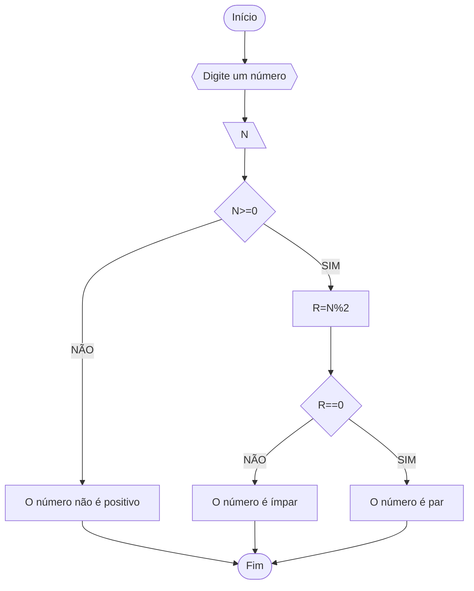

# Unifor 
**Nome**: Luiza
**Nome de disciplina**: Raciocínio lógico algorítmico

## Exercício 3
### Fluxograma

### Pseudocódigo
```
1 ALGORÍTMO verificar_par_ou_ímpar
2 DECLARE N, R NUMÉRICO
3 ESCREVA “Digite o número”
4 LEIA N
5 SE N>=0 ENTÃO
6 	R⇐N%2
7 	SE R==0 ENTÃO 
8 		ESCREVA “NUMERO É PAR”
9 	SENÃO
10		ESCREVA ”NUMERO É IMPAR”
11 	SENÃO
12 		ESCREVA “O NÚMERO NÃO É POSITIVO”0
13 FIM_ALGORITMO
```
