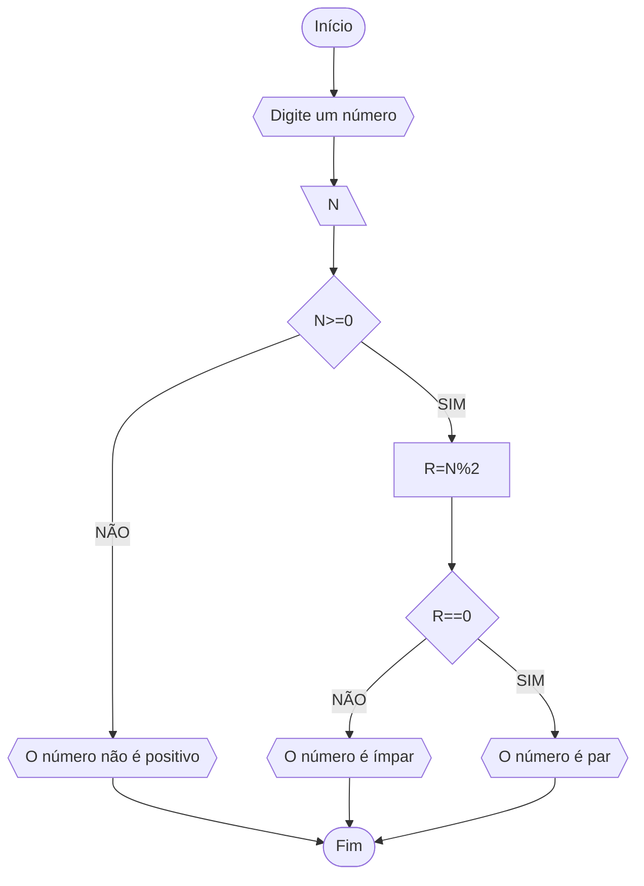
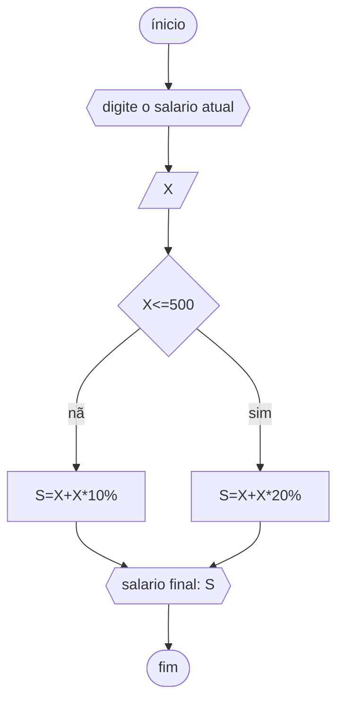
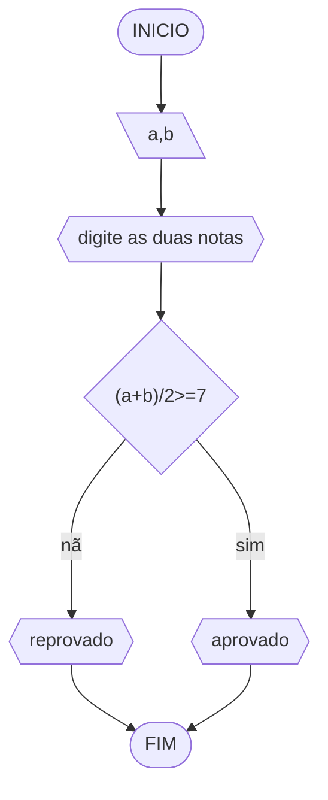
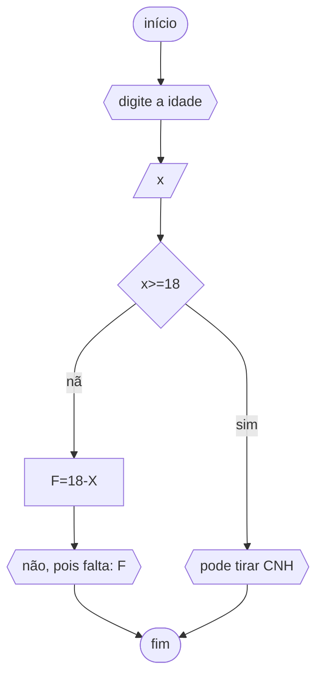

# Unifor 
**Nome**: Luiza
**Nome de disciplina**: Raciocínio lógico algorítmico

## Q1
### Fluxograma

### Pseudocódigo
```
1 ALGORÍTMO verificar_par_ou_ímpar
2 DECLARE N, R NUMÉRICO
3 ESCREVA “Digite o número”
4 LEIA N
5 SE N>=0 ENTÃO
6 	R⇐N%2
7 	SE R==0 ENTÃO 
8 		ESCREVA “NUMERO É PAR”
9 	SENÃO
10		ESCREVA ”NUMERO É IMPAR”
11 	SENÃO
12 		ESCREVA “O NÚMERO NÃO É POSITIVO”
13 FIM_ALGORITMO
```
### Teste
| numero | numero >= 0 | resto | resto == 0 | Saída |
| -- | -- | -- | -- | -- | 
| -1 | F |   |   | "O número não é positivo" |
| 0  | V | 0 | V | "O número é par" |
| 13 | V | 1 | F | "O número é impar" |
| 30 | V | 0 | V | "O número é par" |

## Q2
### fluxograma 

### Pseudocodigo
```
Algoritmo ContaAprovacoes
DECLARE X, S NUMÉRICO
ESCREVA "digite o salario atual"
LEIA X
	SE X<=500 ENTÃO
		S⇐X+(X*20%)
	SENÃO 
		S⇐X+(X*10% )
	FIM_SE
ESCREVA "salario final: " S
FIM_ALGORITMO
```
### Teste
salario | <=500 | saida
-|-|-
500 | sim | 600
444| sim | 532,8
800| não | 960
## Q3
### fluxograma

### Pseudocodigo
```
ALGORITMO media
DECLARE a, b: NÚMERICO
ESCREVA "digite as duas notas"
LEIA a,b
	SE [(a+b)/2>=7] ENTÃO
		ESCREVA "APROVADO"
	SENÃO ESCREVA "REPROVADO"
FIM_ALGARITMO
```
notas | media | >=7 | saida
-|-|-|-
8,8| 8 | sim | aprovado
5,10 | 7.5 | sim | aprovado
5.5,7.5 | 6.5 | não | reprovado
## Q4
### fluxograma

### pseudocodigo
```
ALGORITMO CNH
DECLARE x,F: NUMÉRICO
ESCREVA"digite a idade"
LEIA x
	SE x>=18 ENTÃO
		ESCREVA "pode tirar CNH"
	SENÃO
		F⇐18-x
	FIM_SE
ESCREVA "não, pois falta: "F" 
FIM_ALGORITMO
```
### Teste
idade | >=18 | falta | saida
-|-|-|-
18 |sim | - | pode tirar CNH
20 | sim | - | pode tirar CNH
14| não | 4 |não, pois falta: 4
